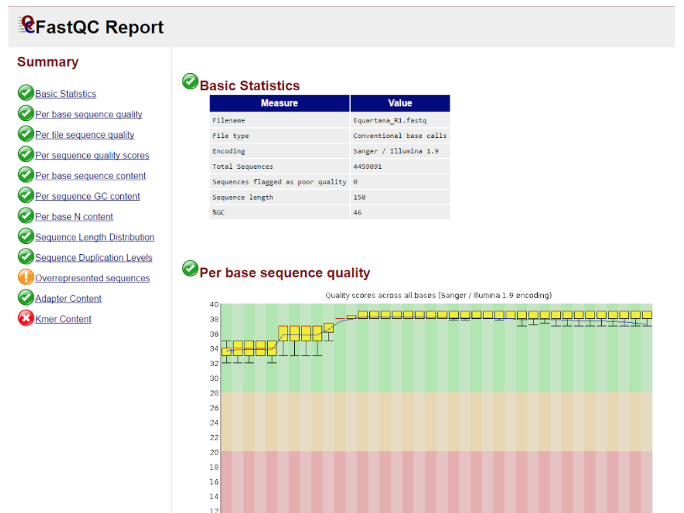

# Quality Control

[fastqc](http://www.bioinformatics.babraham.ac.uk/projects/fastqc/)  

One of the most commonly used tools for the basic quality control of the raw reads in [fastq format](https://en.wikipedia.org/wiki/FASTQ_format).   

`fastqc <file.fastq>`

Results are in the .html file, you have to download them to your desktop and view in the webbrowser. Currently we can not view .html files at the server.  

It should look more or less like that.

